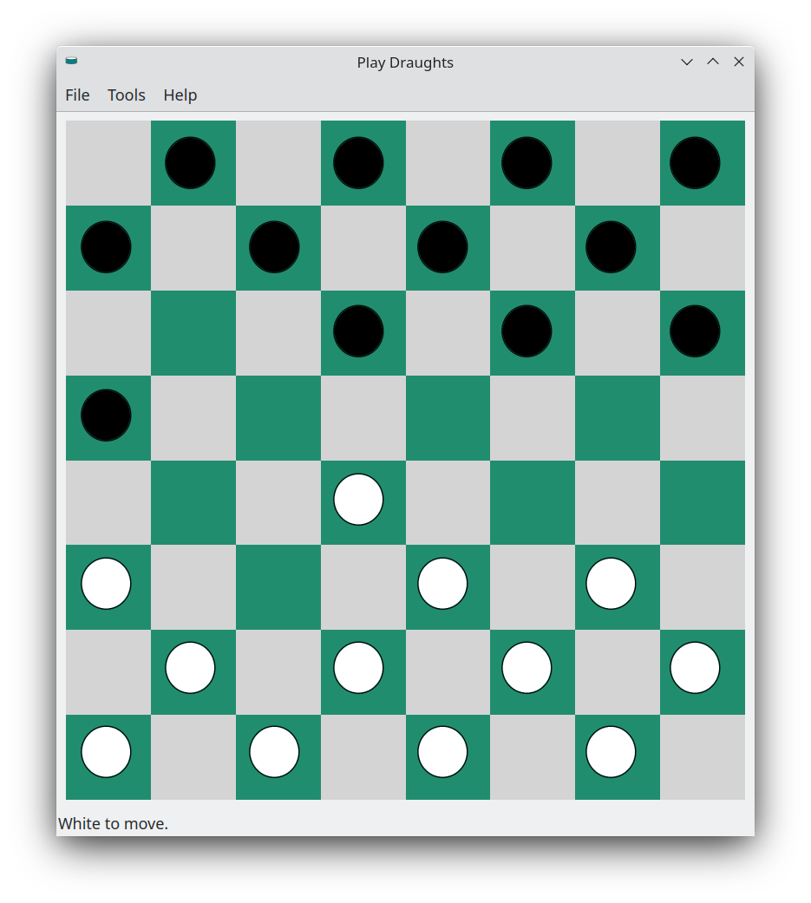

# Play Draughts

Play Draughts is a Linux human vs computer draughts game developed using C++ and [Qt5.15](https://doc.qt.io/qt-5/lgpl.html).




### Prebuilt Binary

A prebuilt binary for Play Draughts is available and can be downloaded from the [binary](https://github.com/crispinalan/playdraughts/tree/main/binary) folder and can be run on any distro which has the Qt5 libraries installed.

With many KDE distros such as [Kubuntu](https://kubuntu.org/), [KaOS](https://kaosx.us/), [Siduction KDE](https://siduction.org/), [KDE Neon User Edition](https://neon.kde.org/) and [Debian 12 Bookworm KDE](https://cdimage.debian.org/cdimage/weekly-builds/amd64/iso-cd/) the Qt5 libraries are installed by default and you just need to double click on the Play Draughts executable to run it once extracted.

With Gtk distros such as Ubuntu you will have to install the Qt libraries.


## Using Play Draughts

A  human vs computer draughts game.

* The human player (white) goes first and moves up the board.
* Left mouse click on a piece to select it and then second click on the square to move to.
* If a capture is possible then move over the piece and click on the adjacent empty square.
* If a multiple capture is possible then make multiple moves.
* The rules of draughts are that capturing is mandatory.
* The computer makes a move once the player has finished.
* Minimax AI is used for the game play.

* Game move information is updated in the status bar in the form (x1,y1)->(x2,y2).
* The x coordinates run from left to right (0 to 7)
* The y coordinates run from top to bottom (0 to 7)

You can use

```
Tools -> Reset Player
```

to reset the human player game mouse click if this becomes out of sequence e.g. when making follow-on captures.

A piece which reaches the promotion line (the most distant row on the opponent's side) becomes a king and can move backwards and forwards.


For more information on the Draughts game follow this [link](https://en.wikipedia.org/wiki/Draughts).


## Compiling Source Code

The C++ Qt source code is provided in the src folder.

Play Draughts uses cmake for the build system and the GNU C++ compiler. You need to ensure that the Qt development libraries are installed. Then

```
mkdir build
cd build
cmake ..
make
```

## Versioning

[SemVer](http://semver.org/) is used for versioning. The version number has the form 0.0.0 representing major, minor and bug fix changes.

Any bugs found will be fixed and the version number updated accordingly.

## Author

* **Alan Crispin** [Github](https://github.com/crispinalan)


## License

Play Draughts Qt is licensed under GPL v3.0.


## Acknowledgements

* Qt is a software development framework for cross-platform development and is available under the GNU Lesser General Public License [version 3](https://doc.qt.io/qt-5/lgpl.html). The Qt Company have recently released the Qt 5.15.6 LTS version as [open-source](https://www.phoronix.com/news/Qt-5.15.6-LTS-Open-Source).

